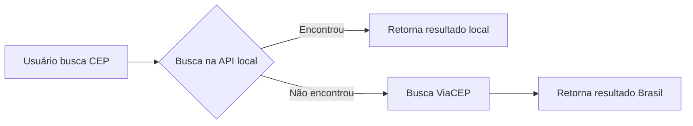

# 🗺️ Sistema de Busca de CEP - Guaíra/SP

<div align="center">


**Sistema completo de busca de CEP com integração ViaCEP, chat inteligente e interface moderna**

[🚀 Demo](#) • [📖 Documentação](./FUNCIONAMENTO.md) • [🔧 Deploy](./DEPLOY_FINAL.md)

</div>

---

## 📋 Índice

- [Sobre o Projeto](#-sobre-o-projeto)
- [Principais Funcionalidades](#-principais-funcionalidades)
- [Tecnologias Utilizadas](#-tecnologias-utilizadas)
- [Estrutura do Projeto](#-estrutura-do-projeto)
- [Como Executar](#-como-executar)
- [Melhorias Recentes](#-melhorias-recentes)
- [Integração ViaCEP](#-integração-viacep)
- [Chat Inteligente](#-chat-inteligente)
- [Contribuindo](#-contribuindo)
- [Autor](#-autor)

---

## 🎯 Sobre o Projeto

Sistema web moderno para busca de CEPs e endereços de **Guaíra/SP** e **todo o Brasil**, desenvolvido com React e integração com a API ViaCEP. O projeto oferece uma interface intuitiva, chat assistente e recursos avançados de favoritos e histórico.

### 🌟 Diferenciais

- 🔍 **Busca Dupla Inteligente**: Base local (Guaíra/SP) + ViaCEP (Brasil inteiro)
- 💬 **Chat Assistente (Lumi)**: Busque CEPs conversando naturalmente
- ⚡ **Performance Otimizada**: Interface leve e responsiva
- ❤️ **Favoritos & Histórico**: Salve seus CEPs mais usados
- 📱 **Responsivo**: Funciona perfeitamente em mobile e desktop
- 🎨 **UI Moderna**: Design limpo com Tailwind CSS e Lucide Icons

---

## 🚀 Principais Funcionalidades

### 1️⃣ Busca por Endereço
- Digite rua, avenida ou logradouro
- Filtro opcional por bairro
- Suporte a números por extenso ("rua oito" = "rua 8")
- Resultados da base local + ViaCEP

### 2️⃣ Busca por CEP
- Digite o CEP (com ou sem hífen)
- Aceita números por extenso
- Busca em Guaíra e todo o Brasil via ViaCEP
- Indicador visual de origem dos dados

### 3️⃣ Chat Inteligente - Lumi 🤖
- Busque CEPs conversando: "CEP 14900-000"
- Busque endereços: "Rua 8"
- Resultados instantâneos
- Integração com base local e ViaCEP

### 4️⃣ Favoritos
- Salve endereços importantes
- Visualize todos os favoritos em uma aba dedicada
- Link direto para Google Maps
- Atualização automática

### 5️⃣ Histórico de Pesquisas
- Últimas 10 pesquisas salvas
- Histórico separado por tipo (CEP/Endereço)
- Botão para limpar histórico
- Oculta automaticamente quando há resultados

### 6️⃣ Compartilhamento
- Copiar CEP com um clique
- Compartilhar via Web Share API
- Links diretos para Google Maps

---

## 🛠️ Tecnologias Utilizadas

### Frontend
- **React 18.2.0** - Biblioteca UI
- **Vite 5.4.20** - Build tool e dev server
- **Tailwind CSS 3.4.8** - Estilização
- **Lucide React 0.546.0** - Ícones modernos

### Backend & APIs
- **ViaCEP API** - Dados de CEP do Brasil inteiro
- **API Backend** - Servidor de dados local
- **localStorage** - Favoritos e histórico

### Deploy
- **Vercel** - Hospedagem frontend
- Configurado com `vercel.json`

---

## 📁 Estrutura do Projeto

```
busca_cep/
├── client/
│   ├── src/
│   │   ├── components/
│   │   │   ├── AddressSearch.jsx      # Busca por endereço
│   │   │   ├── CepSearch.jsx           # Busca por CEP
│   │   │   └── Chatbot.jsx             # Chat Lumi
│   │   ├── hooks/
│   │   │   └── useFavorites.js         # Hook de favoritos/histórico
│   │   ├── services/
│   │   │   └── viaCepService.js        # Integração ViaCEP
│   │   ├── App.jsx                     # Componente principal
│   │   ├── main.jsx                    # Entry point
│   │   └── styles.css                  # Estilos globais
│   ├── index.html
│   ├── package.json
│   └── vite.config.mjs
├── server/
│   └── index.js                        # API servidor (opcional)
├── cep.sql                             # Schema banco de dados
├── edital_ceps.csv                     # Dados CEP Guaíra/SP
├── vercel.json                         # Config deploy Vercel
├── README.md                           # Este arquivo
├── FUNCIONAMENTO.md                    # Documentação detalhada
├── DEPLOY_FINAL.md                     # Guia de deploy
├── INTEGRACAO_VIACEP.md               # Doc integração ViaCEP
└── MELHORIAS_CHAT.md                  # Changelog do chat
```

---

## ⚙️ Como Executar

### Pré-requisitos
- Node.js 16+ 
- npm ou pnpm

### 1. Clone o repositório
```bash
git clone https://github.com/seu-usuario/busca_cep.git
cd busca_cep
```

### 2. Instale as dependências
```bash
cd client
pnpm install
# ou npm install
```

### 3. Execute o projeto
```bash
pnpm dev
# ou npm run dev
```

Acesse: `http://localhost:5173`

---

## 🎉 Melhorias Recentes

### ✅ Versão Atual (Novembro 2025)

#### 🎨 Interface & UX
- ✨ Redesign completo da UI com Tailwind CSS
- 🎨 Paleta de cores moderna (emerald, teal, cyan)
- 📱 Layout totalmente responsivo
- ⚡ Otimização de performance (removidas animações pesadas)
- 🧹 Interface limpa (removidos textos informativos desnecessários)

#### 🔧 Funcionalidades
- 🌐 **Integração ViaCEP**: Busca CEPs de todo o Brasil
- 💬 **Chat Funcional**: Lumi agora busca via ViaCEP
- ❤️ **Favoritos Automáticos**: Atualização em tempo real
- 🕐 **Histórico Inteligente**: Oculta quando há resultados
- 🗑️ **Botão Limpar**: Remova todo histórico com 1 clique
- 🎯 **Busca Dupla**: Base local → ViaCEP (fallback)

#### 🐛 Correções
- ❌ Removido alerta de erro de conexão (ConnectionTest)
- 🔧 Corrigidos imports do viaCepService
- ✅ Melhorado tratamento de erros
- 🚀 Performance otimizada (CSS reduzido 140→50 linhas)

---

## 🌐 Integração ViaCEP

### Como Funciona



### Funções Disponíveis

```javascript
import { 
  buscarCepViaCep,           // Busca por CEP
  buscarEnderecoViaCep,      // Busca por endereço
  buscarEnderecoGuaira,      // Atalho Guaíra/SP
  formatarCep                // Formata CEP
} from './services/viaCepService'

// Exemplo
const resultado = await buscarCepViaCep('01310100')
// { cep: "01310-100", logradouro: "Avenida Paulista", ... }
```

📖 **Documentação completa**: [INTEGRACAO_VIACEP.md](./INTEGRACAO_VIACEP.md)

---

## 💬 Chat Inteligente

### Comandos do Chat Lumi

| Comando | Exemplo | Resultado |
|---------|---------|-----------|
| Buscar CEP | `CEP 14900-000` | Retorna endereço do CEP |
| Buscar Rua | `Rua 8` | Lista endereços encontrados |
| Buscar Avenida | `Avenida Brasil` | Busca em Guaíra + ViaCEP |
| Ajuda | `ajuda` ou `help` | Lista de comandos |
| Saudação | `oi`, `olá` | Mensagem de boas-vindas |

### Recursos
- 🔍 Busca local + ViaCEP
- 💡 Sugestões inteligentes
- ✨ Indicador de origem dos dados
- 🚀 Respostas em tempo real

📖 **Mais detalhes**: [MELHORIAS_CHAT.md](./MELHORIAS_CHAT.md)

---

## 📊 Dados

### Base Local (API Backend)
- **Cobertura**: Guaíra/SP
- **Registros**: ~500 CEPs
- **Fonte**: `edital_ceps.csv`
- **Vantagem**: Busca ultrarrápida

### ViaCEP (API Pública)
- **Cobertura**: Todo o Brasil
- **Registros**: Todos os CEPs oficiais
- **Fonte**: Correios
- **Vantagem**: Dados sempre atualizados

---

## 🚀 Deploy

### Vercel (Recomendado)

1. Conecte seu repositório no Vercel
2. Deploy automático!

📖 **Guia completo**: [DEPLOY_FINAL.md](./DEPLOY_FINAL.md)

---

## 🤝 Contribuindo

Contribuições são bem-vindas! Para contribuir:

1. Fork o projeto
2. Crie uma branch: `git checkout -b feature/MinhaFeature`
3. Commit: `git commit -m 'Add: Nova funcionalidade'`
4. Push: `git push origin feature/MinhaFeature`
5. Abra um Pull Request

### Ideias para Contribuir
- [ ] Adicionar mais cidades além de Guaíra
- [ ] Sistema de autenticação
- [ ] Exportar favoritos para CSV
- [ ] PWA (Progressive Web App)
- [ ] Modo escuro
- [ ] Testes automatizados

---

## 📄 Licença

Este projeto está sob a licença MIT. Veja o arquivo [LICENSE](LICENSE) para mais detalhes.

---

## 👨‍💻 Autor

**Talisson Mendes**

- 💼 LinkedIn: [Seu LinkedIn](#)
- 🐙 GitHub: [@seu-usuario](#)
- 📧 Email: seu.email@exemplo.com

---

## 🙏 Agradecimentos

- [ViaCEP](https://viacep.com.br/) - API pública de CEPs
- [Lucide](https://lucide.dev/) - Ícones lindos
- [Tailwind CSS](https://tailwindcss.com/) - Framework CSS

---

<div align="center">

**⭐ Se este projeto te ajudou, deixe uma estrela! ⭐**

Feito com ❤️ em Guaíra/SP

</div>

### ✅ Interface Moderna
- Design responsivo com gradientes
- Animações suaves
- Cards coloridos para resultados
- Notificações toast
- Ícones FontAwesome

### ✅ Funcionalidades Extras
- Copiar CEP com um clique
- Exemplos clicáveis
- Busca automática ao digitar
- Carregamento de arquivos Excel
- Dados de fallback para demonstração

## Dados de Demonstração

O sistema inclui dados de exemplo para Guaíra-SP:
- Avenida Brasil, Centro - CEP: 14790-000
- Rua das Flores, Jardim das Acácias - CEP: 14790-001
- Rua São José, Vila São José - CEP: 14790-002
- Avenida dos Pioneiros, Centro - CEP: 14790-003
- Rua da Esperança, Jardim Esperança - CEP: 14790-004

## Status dos Erros

### ❌ Erros Ignorados (pasta client/)
Os erros de Tailwind CSS na pasta `client/` são de um projeto separado e não afetam nosso sistema principal.

### ✅ Sistema Principal
- ✅ HTML carregando corretamente
- ✅ CSS aplicado com sucesso
- ✅ JavaScript funcionando
- ✅ Busca de CEP operacional
- ✅ Interface responsiva

## Próximos Passos

1. Abra o `index.html` no navegador para testar
2. Experimente buscar pelos exemplos fornecidos
3. Se quiser usar dados reais, prepare um arquivo Excel conforme especificado
4. O sistema está pronto para uso!

---

**Status: ✅ SISTEMA FUNCIONANDO**